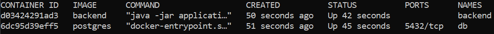

# Zugriff

> Es kann nur auf die Datenbank zugegriffen werden während Docker den dazugehörigen Container ausführt.
```plaintext
$ docker ps
```
Hier wird eine Auflistung an Container-Ids zurückgegeben. Die Auflistung sieht in etwa so aus:


Hier sucht man sich die Container-Id raus, bei der Image `postgres` und der Name `db` ist (in der Abbildung oben wäre das `6dc95d39eff5`).
```plaintext
$ docker exec -it <container-id> bash
root@<container-id>:/# su postgres
postgres@<container-id>:/$ psql
postgres=# \c aktoria
```
Nun befindet man sich in der Aktoria-Datenbank.

# PostgreSQL-Befehle
```plaintext
\d           /*Listet die Datenbank auf*/
\d+          /*Listet die Datenbank mit Details auf*/
\d <name>    /*Listet die angegebene Tabelle auf*/
\dt          /*Listet alle Tabellen in der Datenbank auf*/
\dt+         /*Listet alle Tabellen in der Datenbank mit Details auf*/
\df          /*Listet alle Funktionen der Datenbank auf*/
\df+         /*Listet alle Funktionen der Datenbank mit Details auf*/
\df <name>   /*Listet die angegebene Funktion auf*/
\?           /*Hilfe zu psql Befehlen
\q           /*Verlassen von psql*/
```