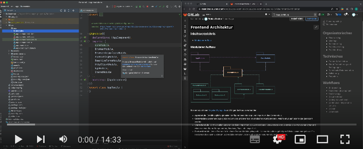

## Inhaltsverzeichnis

- [Walkthrough](#walkthrough)
- [Modularer Aufbau](#modularer aufbau)

## Walkthrough

[
**Walkthrough auf Youtube (Stand 04.06.2022):**

](https://www.youtube.com/watch?v=7IrHr3-Dohs)

## Modularer Aufbau

Basierend auf dem [Angular Styleguide](https://angular.io/guide/styleguide) sind folgende Module vorhanden:

- **AppModule**: Enthält jegliche globalen Konfigurationen der App und importiert das CoreModule.
- **CoreModule**: Bestehend aus globalen Services und eventuellen statischen Komponenten, welche etwa auf jeder Page gerendert werden.
- **SharedModule**: Wird von allen anderen Modulen importiert. Es werden überall verwendete Module sowie alle Arten generischer und wiederverwendbarer Komponenten, Services, Pipes, etc. exportiert.
- **FeatureModule**: Jedes Feature ist in einem FeatureModule gekapselt. Hier werden alle zugehörigen Blöcke zusammengefasst. Ein FeatureModule kann wiederum Submodule enthalten, oder auch andere FeatureModules importieren.