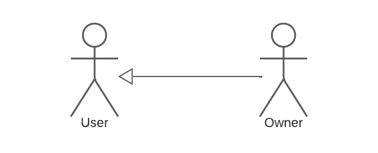
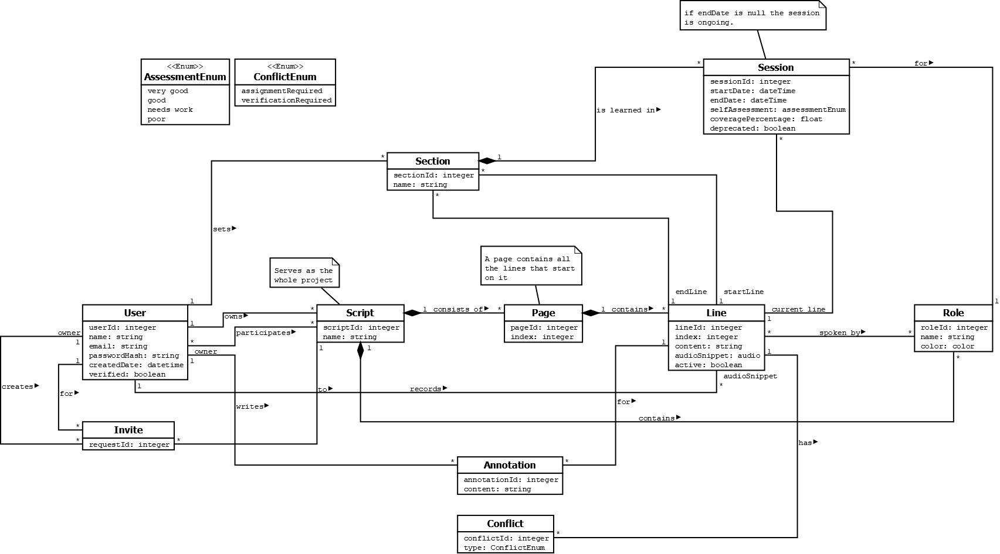
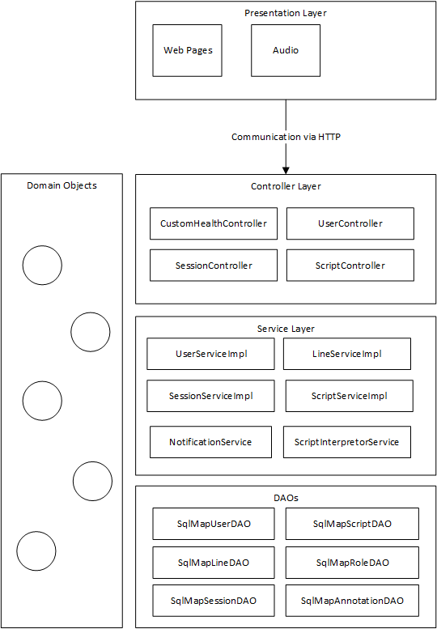
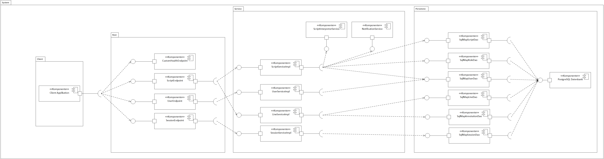

# Projektbezeichnung und Entwicklerteam

Das Projekt trägt den Titel _Aktoria_ und wird von folgendem Team umgesetzt:
| Id | Name | Rolle | Stellvertretende Rolle |
|----|------|-------|------------------------|
| jbernold | Julia Bernold | Dokumentationsbeauftragte | Frontend Lead |
| lnemeskeri | Luke Nemeskeri | Teamkoordinator | Testleiter |
| mflandorfer | Marvin Flandorfer | Backend Lead | Teamkoordinator |
| npeter | Nikolaus Peter | Technischer Architekt | Backend Lead |
| skreuzpointner | Simon Kreuzpointner | Testleiter | Dokumentationsbeauftragter |
| tgruber | Tobias Gruber | Frontend Lead | Technischer Architekt |

# Ausgangssituation

SchauspielerInnen müssen sich viele Skripte einprägen und arbeiten präferiert mit KollegInnen, welche durch Feedback und Gegensprechen derer Rollen unterstützen können. Es wird allerdings, speziell im Distance Learning, viel alleine geprobt, wofür auch bereits bestehende Apps Unterstützung bieten. Solche ermöglichen das Üben eigener Skripte mit eingesprochenen Stimmen anderer Rollen. Allerdings sind NutzerInnen noch immer auf KollegInnen angewiesen, erhalten von solchen Apps kein Feedback auf deren Leistung und es fehlt an Übersicht des Lernfortschritts.

# Projektbeschreibung

SchauspielerInnen benötigen eine App, mit welcher diese gemeinsam, auch ohne Unterstützung von KollegInnen, wie in Gruppen lernen können und Rückmeldungen erhalten.

_Aktoria_ soll dies ermöglichen. In Lernsessions sollen SchauspielerInnen deren Texte üben können, wobei Rollen anderer entweder mittels Sprachsynthese oder -aufzeichnungen gegengesprochen und eigener Text ggf. verborgen wird. Fortschritt solcher Einheiten wird durch Feedback der SchauspielerInnen gemessen, wobei unterstützend mittels Spracherkennung rückgemeldet wird, wie viel des eingesprochenen Textes (unter Berücksichtigung einer Fehlertoleranz) übereinstimmt. Zur konkreten Überprüfung kann eigens gesprochener Text nachträglich angehört werden. Basierend auf den Bewertungen werden, angelehnt an dem Prinzip des Active Recalls, anstehende Lerneinheiten vorgeschlagen.

Zuerst müssen sich NutzerInnen registrieren und können dann den vorgegebenen Formaten entsprechende Skripte hochladen und anschließend Rollen und Textzuweisungen überprüfen bzw. korrigieren. Diese Skripte können optional mit KollegInnen geteilt werden, welche nun auch mit dem Tool diese üben und gegenseitig einsprechen können.

_Aktoria_ soll allerdings nicht als Texteditor fungieren, sondern bloß das Korrigieren oder Streichen von Texten erlauben. Zudem soll dieses Tool weder File-Sharing-, noch Kommunikations- oder Projektmanagement Dienste ersetzten, sondern lediglich als ergänzendes Werkzeug für Proben dienen.

# Zielgruppen

Theater-SchauspielerInnen, welche hochdeutsche Texte auswendig lernen müssen. Ihnen wird das Lernen durch Feedback und an Active Recall angelehnten Methoden erleichtert.

RegieassistentInnen, zum Annotieren von Skripten, sodass Theater-SchauspielerInnen mit diesen auch arbeiten können.

Es wurde eine UML Aktorenhierarchie hinzugefügt, auf welche sich die Iceberglist bezieht. Es kann sowohl ein/e RegieassistenIn, als auch ein/e Theater-SchauspielerIn BesitzerIn eines Scripts sein.

| Aktor | Rechte im System | Anmerkungen |
|-------|------------------|-------------|
| User | Kann mit einem Script lernen und die Stimme aufnehmen lassen. Weiters erhält der User Feedback zu der Leistung. | Jeder User kann Scripte hochladen und wird damit zu dem Owner von diesen Script. |
| Owner | Kann User zu einem Script einladen und kann Scripten annotieren. | Ist selbst ein User und hat somit alle Rechte eines Users. |

# Funktionale Anforderungen, Anwendungsfälle

## Featureliste

### Bestehender Funktionsumfang
| Id | Feature | Beschreibung | Kunden Priorität | Aufwand |
|----|---------|--------------|------------------|---------|
| 1.1 | Kontoverwaltung | NutzerInnen können Konten anlegen und wieder löschen, wobei Email Adressen per Bestätigungslink validiert werden. Weitere Daten jederzeit geändert werden. | H | 5 |
| 1.2 | Login | NutzerInnen können sich mit ihren Konten anmelden. | H | 8 |
| 2.1 | Skriptverwaltung | NutzerInnen können Skripte in Form eines PDFs Uploads anlegen, ansehen und wieder löschen. Zudem können Titel, sowie Bezeichnungen der Rollen jederzeit geändert werden. | H | 3 |
| 2.2.1 | Automatische Rollenerkennung | In vorgegebenen Format hochgeladene Skripte werden interpretiert, sodass den NutzerInnen automatisch Rollen vorgeschlagen werden. | H | 8 |
| 2.2.2 | Automatische Textzuweisungen | In vorgegebenen Format hochgeladene Skripte werden interpretiert, sodass den NutzerInnen automatisch für jede erkannte Rolle der zugewiesene Text vorgeschlagen werden. | H | 13 |
| 2.3 | Mitgliederverwaltung | ErstellerInnen von Skripten können Mitglieder einladen und wieder entfernen. Einladungen erfolgen automatisch per Email. | M | 3 |
| 3.1 | Übungsmodus | NutzerInnen können deren Skripte in einem Übungsmodus lernen. | H | 5 |
| 3.2.1 | Stimmen aufzeichnen | NutzerInnen können deren Rollen einsprechen. Bereits eingesprochene Sprachaufnahmen dieser Texte (auch solche anderer Rollen, falls ein Text mehreren Rollen angehört) werden überschrieben. | M | 5 |
| 3.2.2A | Stimmen wiedergeben | NutzerInnen können eingesprochene Texte anderer Rollen vorlesen lassen. | M | 3 |
| 3.3 | Stimme überprüfen | NutzerInnen können nach Abschließen einer Übungseinheit deren Stimmen, unabhängig von der Speicherung dieser, zum Überprüfen anhören. Dies ist allerdings nur gänzlich gewährleistet, wenn diese Session nicht pausiert und zu einem späteren Zeitpunkt fortgesetzt wurde. | M | 3 |
| 3.4 | Autoplay | Stimmen anderer Rollen werden automatisch wiedergeben. Nach Beendigung wird zur nächsten Phrase gesprungen. | M | 1 |
| 4 | Annotationen | NutzerInnen können zu Textphrasen Kommentare erstellen und diese ggf. ändern oder löschen. | N | 3 |
| 5 | Benachrichtigungen | Mitglieder erhalten Benachrichtigungen per Email für jegliche Textänderungen derer Skripte. | N | 3 |

### Neue Features
| Id | Feature | Beschreibung | Kunden Priorität | Aufwand |
|----|---------|--------------|------------------|---------|
| 2.1B | Skriptverwaltung | NutzerInnen können Texte in Skripten ausblenden oder abändern, wobei letzteres eine Löschung gepeicherter Sprachaufnahmen bewirkt. | H | 5 |
| 2.4.1 | Manuelle Rollenzuweisung | NutzerInnen können nach automatischer Skripterkennung Rollen hinzufügen oder diese sowie deren Textzuweisungen ändern. | H | 8 |
| 2.4.2 | Rollenvereinigung | Es können jederzeit Rollen vereinigt werden, sodass Texte beider Rollen nun der Vereinigten angehören. | M | 3 |
| 2.5 | Inhaltliche Änderungen | NutzerInnen können beim Ändern, Ausblenden und neu Zuweisen von Texten angeben, ob es sich um inhaltliche oder geringfügige Änderungen handelt. Erstere bewirken, dass bestehende Lernfortschritte und Sprachaufnahmen der betroffenen Passagen verloren gehen. | H | 5 |
| 2.6 | Konfliktbehandlung | Im Falle unentscheidbarer Probleme im Zuge der automatischen Skripterkennung werden NutzerInnen zu einer Behandlung dieser gefordert. | H | 5 |
| 3.2.2B | Stimmen wiedergeben | NutzerInnen können nicht-eingesprochene Texte von Rollen automatisch mittels Sprachsynthese vorlesen lassen. | H | 2 |
| 3.5 | Bewertung | NutzerInnen können ihre Übungseinheiten nach diskretem Schema bewerten. | H | 1 |
| 3.6 | Spracherkennung | Eingesprochener Text wird mit Fehlertoleranz erkannt. Nach Übungseinheiten wird NutzerInnen visualisiert, wie viel eingesprochener Text richtig erkannt wurde (zur Unterstützung des Feedbacks). Dies ist allerdings nur gänzlich gewährleistet, wenn diese Session nicht pausiert und zu einem späteren Zeitpunkt fortgesetzt wurde. Dieses Feature soll nur für den Chrome Browser unterstützt sein. | N | 5 |
| 3.7 | Steuerungselement | NutzerInnen können Übungseinheiten pausieren und Texte über- oder zurückspringen. Zudem können Autoplay, Sprachausgabe und Verbergen des eigenen Texts konfiguriert werden. | H | 3 |
| 3.8 | Lernsitzung | Sitzungen von Lerneinheiten werden zwischengespeichert und können später fortgesetzt werden. | M | 1 |
| 6.1 | Lernabschnitte | NutzerInnen müssen zum Starten von Übungseinheiten Lernabschnitte in Form von Seitenangaben definieren. Diese können im Nachhinein wiederverwendet werden. | H | 5 |
| 6.2 | Vorschläge | NutzerInnen erhalten basierend auf dem Übungs-Feedback Vorschläge, welche Abschnitte wieder gelernt werden sollen. | H | 2 |
| 6.3 | Lernabschnitt Vorschau | NutzerInnen erhalten Vorschauen von Lernabschnitten, ohne diese extra öffnen zu müssen. | N | 1 |
| 7 | Timeline | NutzerInnen können eine Timeline derer Lerneinheiten einsehen. | N | 2 |

## Anwendungsfall Übersicht

Die Features aus der Featureliste wurden zu folgenden Anwendungsfallpaketen zusammengefasst. Da der Funktionsumfang recht umfangreich ist, wurde auch eine Priorisierung (**H**och, **M**ittel, **N**iedrig) vorgenommen.

1. Kontoverwaltung (**H**): unbedingt erforderlich, kritisch
2. Skriptverwaltung und -verarbeitung (**H**): unbedingt erforderlich, kritisch
3. Übungsmodus (**M**): nur Grundfunktionalität wichtig (Üben, Stimmen aufzeichnen und abspielen)
4. Benachrichtigungen (**N**): erweiterndes Feature, kann auch nach Projektende implementiert werden
5. Lernabschnitte (**M**): nur Grundfunktionalität wichtig (Lernabschnitte definieren und verwenden)

## Iceberglist
| Id | Feature, Akteur | Anwendungsfälle | Kunden Priorität | Aufwand | Version | Zuständiger |
|----|-----------------|-----------------|------------------|---------|---------|-------------|
| 1.1 | Kontoverwaltung, Anonym | Account anlegen | H | 2 | 1 | lnemeskeri |
| 1.2 | Kontoverwaltung, User | Account löschen | H | 1 | 1 | jbernold |
| 1.3 | Kontoverwaltung, User | Accountdaten ändern | H | 1 | 1 | tgruber |
| 1.4 | Kontoverwaltung, User | Email verifizieren | H | 3 | 1 | npeter |
| 1.5 | Kontoverwaltung, User | Login | H | 7 | 1 | mflandorfer |
| 1.6 | Kontoverwaltung, User | Passwort ändern | H | 1 | 1 | npeter |
| 1.7 | Kontoverwaltung, User | Neues Passwort anfordern | H | 2 | 1 | jbernold |
| 1.8 | Kontoverwaltung, User | Email ändern | H | 2 | 1 | npeter |
| 2.1 | Skriptverwaltung, User | Skript (PDF) hochladen | H | 10 | 1 | skreuzpointner |
| 2.2 | Skriptverwaltung, User | Skript ansehen | H | 3 | 1 | tgruber |
| 2.3 | Skriptverwaltung, Besitzer | Skript löschen | M | 2 | 1 | jbernold |
| 2.4.1 | Skriptverwaltung, Besitzer | User zum Skript einladen | H | 2 | 2 | lnemeskeri |
| 2.4.2 | Skriptverwaltung, Besitzer | User vom Skript entfernen | M | 1 | 2 | lnemeskeri |
| 2.5.1 | Skriptverwaltung, Besitzer | Texte im Skript ausblenden | M | 5 | 2 | jbernold |
| 2.5.2 | Skriptverwaltung, Besitzer | Texte im Skript abändern | H | 5 | 2 | mdlandorfer |
| 2.6.1 | Skriptverwaltung, Besitzer | Texte im Skript Rollen zuweisen | H | 7 | 2 | tgruber |
| 2.6.2 | Skriptverwaltung, Besitzer | Rollen im Skript vereinigen | H | 3 | 2 | skreuzpointner |
| 3.1 | Übungsmodus, User | Skript im Übungsmodus lernen | H | 8 | 2 | lnemeskeri |
| 5.1 | Lernabschnitte, User | Lernabschnitte festlegen | H | 5 | 2 | npeter |
| 5.2 | Lernabschnitte, User | Lernabschnitte löschen | M | 1 | 2 | lnemeskeri |
| 5.3 | Lernabschnitte, User | Vorschau des Lernabschnitts ansehen | N | 2 | 2 | npeter |
| 5.4 | Lernabschnitte, User | Über Lernabschnitt eine Übung starten | H | 1 | 2 | npeter |
| 5.5 | Lernabschnitte, User | Vergangene Lerneinheiten ansehen | N | 2 | 2 | lnemeskeri |
| 2.7 | Skriptverwaltung, Besitzer | Konflikte im Skript behandeln | H | 4 | 3 | npeter |
| 3.2 | Übungsmodus, User | Stimme für eine Stelle im Skript aufnehmen | M | 6 | 3 | tgruber |
| 3.3.1 | Übungsmodus, User | Aufnahmen im Übungsmodus abspielen lassen | M | 3 | 3 | lnemeskeri |
| 3.3.2 | Übungsmodus, User | Skriptstellen im Übungsmodus durch Sprachsynthese abspielen lassen | M | 2 | 3 | tgruber |
| 3.3.3 | Übungsmodus, User | Aufnahmen nach Beendigung der Übung abspielen lassen | N | 2 | 3 | jbernold |
| 3.4 | Übungsmodus, User | Automatische Wiedergabe anderer Rollen im Übungsmodus | M | 3 | 3 | jbernold |
| 3.5 | Übungsmodus, User | Bewerten der eigenen Leistung | M | 2 | 3 | mflandorfer |
| 3.6.1 | Übungsmodus, User | Im Übungsmodus zurückspringen | M | 1 | 3 | tgruber |
| 3.6.2 | Übungsmodus, User | Im Übungsmodus überspringen | M | 1 | 3 | tgruber |
| 3.6.3 | Übungsmodus, User | Im Übungsmodus eigenen Text verbergen | H | 1 | 3 | skreuzpointner |
| 3.7.1 | Übungsmodus, User | Übung pausieren | H | 2 | 3 | mflandorfer |
| 3.7.2 | Übungsmodus, User | Übung fortsetzen | H | 3 | 3 | mflandorfer |
| 2.8.1 | Skriptverwaltung, Besitzer | Annotationen im Skript anlegen | M | 2 | 4 | lnemeskeri |
| 2.8.2 | Skriptverwaltung, Besitzer | Annotationen im Skript bearbeiten | M | 2 | 4 | npeter |
| 2.8.3 | Skriptverwaltung, Besitzer | Annotationen im Skript löschen | M | 1 | 4 | jbernold |
| 2.8.4 | Skriptverwaltung, User | Annotationen im Skript ansehen | M | 1 | 4 | jbernold |
| 4 | Benachrichtigungen, User | Benachrichtigung über Änderungen im Skript erhalten | N | 3 | 4 | npeter |

# Domänenmodell

# Arbeitsstruktur und grober Projektplan

Das Projektteam besteht aus 6 Entwicklern, deren Rollen bereits im Projektvorschlag festgelegt wurden. Bei unserem Projekt wird grundsätzlich SCRUM angewendet. Um die Planungsphase besser zu strukturieren haben wir uns zusätzlich für Kanban entschieden.

## Rollenverteilung

Siehe Projektbezeichnung und Entwicklerteam vom Projektvorschlag. Jeder der Entwickler hat zwar eine bestimmte Expertenrolle, allerdings heißt das nicht, dass jeder nur strikt seine eigene Rolle erledigt.

## Horizontale Verantwortlichkeiten

### Technischer Architekt: npeter

Der Technische Architekt verwaltet Ordnerstruktur und Bibliotheken. Er hat viel Wissen über die verwendeten Programmiersprachen, Software Patterns und so weiter. Der technische Architekt verfügt über Expertenwissen zu verwendeten Technologien (z.B. Maven, Angular). Weiters ist er verantwortlich für Design der Programmarchitektur und Programmkomponenten.

### Team Koordinator: lnemeskeri

Der Teamkoordinator verfügt über viel Wissen bezüglich Projektmanagement und ist sowohl für die Organisation des Teams intern zuständig als auch der Hauptansprechpartner für die Autraggeber und somit zuständig für die Organisation externer Meetings. Eine weitere Verantwortung ist die Kontrolle der Aufgabenverteilung.

### Dokumentationsbeauftragte: jbernold

Die Dokumentationsbeauftragte ist zuständig für die Sicherstellung passender Dokumentation (einheitlich in Englischer Sprache), Erstellung von Dokumentationsrichtlinien und Kontrolle deren Einhaltung. Weiters ist die Dokumentationsbeauftragte zuständig für die Überprüfung der Vollständigkeit der Dokumentation.

### Testbeauftragter: skreuzpointner

Der Testleiter ist zuständig für die Testinfrastruktur, Erstellung von Testdaten und die strikte Trennung zwischen Testcode und Produktionscode. Weiters ist er zuständig für das Verhalten beim Auftreten von Exceptions, Überprüfung der Einhaltung von Testrichtlinien und die regelmäßige Überprüfung aller Unit-Tests.

### Frontend Lead: tgruber

Der Frontend Lead ist zuständig für die Architektur des Frontends, also dem GUI. Er übernimmt Setup, Strukturierung sowie den modularen Aufbau der Angular App. Des Weiteren soll er sich um die Usability und Kompatibilität der Anwendung kümmern.

### Backend Lead: mflandorfer

Der Backend Lead ist zuständig für die Verwaltung und Strukturierung des Backends (Klassen, Interfaces, Packages) und für die Einhaltung der gewählten Architektur im Backend. Zusätzlich ist der Backend Lead für die Verwaltung der Datenbank und Zugriffe auf die Datenbank zuständig.

## Grober Projektplan

### Work Breakdown Structure (WBS)
| NR | Arbeitspaket | Anfang | Ende | Personentage | Verantwortlich |
|----|--------------|--------|------|--------------|----------------|
| MS. 0 | Kick-Off | 01.04.2022 | 02.04.2022 | 1 |  |
| 1.1 | Anforderungen | 02.04.2022 | 27.04.2022 | 15 |  |
| 1.1.1 | Zielgruppen | 02.04.2022 | 04.04.2022 | 2 | lnemeskeri |
| 1.1.2 | Featureliste | 07.04.2022 | 09.04.2022 | 2 | tgruber |
| 1.2 | Prototyping unbekannter Technologien | 13.04.2022 | 15.04.2022 | 3 | tgruber |
| 1.3 | Architektur Entwurf und Design | 21.04.2022 | 26.04.2022 | 5 | npeter |
| 1.3.1 | Domänenmodell (erster Entwurf) | 21.04.2022 | 23.04.2022 | 2 | skreuzpointner |
| 1.1.3 | Iceberglist | 19.04.2022 | 22.04.2022 | 3 | mflandorfer |
| 1.3.2 | UI Skizzierung und Befragung der Zielgruppe | 23.04.2022 | 26.04.2022 | 3 | tgruber |
| 1.1.4 | WBS und Meilensteine | 25.04.2022 | 27.04.2022 | 2 |  |
| 1.1.5 | Anwendungsfälle | 23.04.2022 | 24.04.2022 | 1 | mflandorfer |
| 1.1.6 | Grober Projektplan | 25.04.2022 | 26.04.2022 | 2 |  |
| 1.1.7 | Nicht-Funktionale Anforderungen | 23.04.2022 | 25.04.2022 | 2 |  |
| 1.1.8 | Risikoabschätzung | 22.04.2022 | 23.04.2022 | 1 | mflandorfer |
| 1.3.3 | ER Diagramm | 23.04.2022 | 25.04.2022 | 2 | mflandorfer |
| 1.4 | Projektantrag fertigstellen | 26.04.2022 | 29.04.2022 | 3 |  |
| 1.3.4 | Komponentendiagramm, im SCM einchecken | 29.04.2022 |  | 1 | npeter |
| 1.3.5 | Domänenmodell (fertiger Entwurf) | 30.04.2022 | 31.04.2022 | 1 | skreuzpointner |
| MS.1 | Projektdefinition, Projektauftrag | 29.04.2022 | 30.04.2022 | 1 |  |
| MR-1 | Management Review 1 | 29.04.2022 | 30.04.2022 | 1 |  |
| 3.0 | Scrum Setup | 30.4.2022 | 2.5.2022 | 3 | jbernold |
| 3.1 | Implementierung Sprint 1 | 2.5.2022 | 15.5.2022 | 14 |  |
| 3.1.1 | DB Schema | 2.5.2022 | 15.5.2022 | 14 | mflandorfer |
| 3.1.2 | Persistenzschicht | 2.5.2022 | 15.5.2022 | 14 | mflandorfer |
| 3.1.3 | Serviceschicht | 2.5.2022 | 15.5.2022 | 14 | jbernold |
| 3.1.4 | GUI | 2.5.2022 | 15.5.2022 | 14 | tgruber |
| 3.1.5 | Authentifizierung | 2.5.2022 | 15.5.2022 | 14 | lnemeskeri |
| 3.1.6 | Rest Layer | 2.5.2022 | 15.5.2022 | 14 | npeter |
| 3.2 | SCM | 2.5.2022 | 15.5.2022 | 14 |  |
| 3.3 | Datenbankanbindung | 2.5.2022 | 15.5.2022 | 14 | tgruber |
| MS.2 | Erster Prototyp | 2.5.2022 | 15.5.2022 |  |  |
| IR-1 | Internes Review 1 (Anforderungs Review), Pre-Release Demo | 16.05.2022 | 17.05.2022 | 1 |  |
| 3.2 | Implementierung Sprint 2, DAO Integration Tests | 16.05.2022 | 29.05.2022 | 14 |  |
| MS.3 | Alpha Version, 50% der User Stories fertig | 29.05.2022 | 30.05.2022 | 1 |  |
| MR-2 | Management Review 2, Alpha Release Demo | 30.05.2022 | 31.05.2022 | 1 |  |
| 3.3 | Implementierung Sprint 3, Service Schicht zu 80-90% fertig | 30.05.2022 | 12.06.2022 | 14 |  |
| MS.4 | Beta Version, 85% der User Stories | 12.06.2022 | 13.06.2022 | 1 |  |
| IR-2 | Internes Review, Beta Version Demo | 13.06.2022 | 14.06.2022 | 1 |  |
| 3.3 | Implementierung Sprint 4, Iceberglist abgearbeitet | 13.06.2022 | 26.06.2022 | 14 |  |
| MS.5 | 100% der User Stories implementiert, Akzeptanztests | 26.06.2022 | 27.06.2022 | 1 |  |
| MR-3 | Management Review 3: Projektabnahme, General Availability Version Demo | 27.06.2022 | 28.06.2022 | 1 |  |

### Meilensteinbeschreibung

1. Projektauftrag
2. Erster Prototyp ohne viel Service Logik. Dabei sollen alle Schichten behandelt werden, wie etwa Datenbank, Logik, Authentifizierung, Rest, GUI. Datenbank Anbindung fertig und deren Architektur zu mindestens 80% fertig.
3. Alpha Version. 50% der Userstories sollen implementiert sein. Kernfeatures nutzbar. Bestehende DAO Schicht durch Integration Tests zu mindestens 80% abgedeckt.
4. Beta Version. 85% der Userstories implementiert. Service Schicht zu 80-90% fertig. Bestehende Service Schicht zu mindestens 80% durch Tests abgedeckt.
5. Release. 100% der Userstories implementiert. Akzeptanz Tests erfolgreich durchgeführt. Iceberglist abgearbeitet.

# Projektabgrenzung

Die fertige Applikation soll ein MVP darstellen und kommerzielle Absichten vernachlässigen. Es behandelt folgende Features nicht, da es bereits umfangreiche andere Lösungen gibt:

- Texteditor: Der Text kann nur auf eine minimale Art editiert werden, um kleine Fehler auszubessern. Skripte sollen nicht erstellt und geschrieben werden.
- Kommunikation: Die Kommunikation ist nur mittels Annotationen möglich und soll nicht andere Kommunikationskanäle ersetzen.
- Projektmanagement: Um sich gegenseitig zu koordinieren, müssen andere Werkzeuge verwendet werden.

Folgende Funktionen sind ebenfalls nicht im Projektumfang vorhanden

- Das Interpretieren von Skripten in nicht unterstützten Formaten
- Eine mobile Ansicht für Smartphones und Tablets

Außerdem ist die Anwendung explizit an Chrome NutzerInnen gerichtet, kann aber auch von Fire-fox NutzerInnen mit minimal eingeschränkten Features verwendet werden.

# Schichtendiagramm

# Lieferkomponenten

Während der Projektlaufzeit und vor allem beim Abschluss des Projektes wird dem Kunden die erstellte Software sowie dazugehörige Dokumentation übergeben. In diesem Abschnitt werden die Softwarekomponenten und Dokumentation beschrieben und eine Abgrenzung des Lieferumfangs durchgeführt.

## Software

Folgende Komponenten werden nach Projektabschluss an den Kunden übergeben:

- Git Repository mit dem Source Code des Front- und Backends
- Built Angular App
- Built Spring Boot App
- Postgresql Datenbank mit Datenbankskripts zur Initialisierung
- Konfigurationsdaten für Datenbanken und Server

## Artefakte und Projektdokumentation

- Domänenmodell
- Komponentendiagramm
- ER-Diagramm & Relationenmodell
- PA Präsentation
- Testberichte
- Funktionale Anforderungen
  - Anwendungsfallbeschreibung

## Meilensteine

Meilenstein 1: Projektauftrag

Meilenstein 2: Erster Prototyp

- IR 1 – Bericht
- Artefakte des laufenden Projektmanagements (Timetracking, Icerberglist, WBC, …)
- Testartefakte
- Datenbankanbindungen fertig
- Erste Systemtests mit GUI

Meilenstein 3: Alpha-Version

- Artefakte des laufenden Projektmanagements
- MR – 2 Bericht
- Alpha-Version (Kernfeatures nutzbar) mit DAO Tests + 50% der Userstories implementiert

Meilenstein 4: Beta-Version

- Artefakte des laufenden Projektmanagements
- IR – 2 Bericht
- 85% der Userstories implementiert
- Serviceschicht zu 80% durch Tests abgedeckt

Meilenstein 5: Release

- Artefakte des laufenden Projektmanagements
- MR – 3 Bericht
- 100% der Userstories implementiert
- Akzeptanztests vollständig abgeschlossen

## Abgrenzung des Lieferumfangs

Nicht im Lieferumfang des Produktes (MR 3) enthalten sind:

- Iceberglist
- GANTT-Diagramm, Burn-Down Charts
- Artefakte des laufenden Projektmanagements
- UI Skizzen

# Nichtfunktionale Anforderungen

- **Unterstützung**: Die Anwendung soll auf Desktop Geräten für Google Chrome (Versionen 90-100) und Firefox (Versionen 97-99) verfügbar sein, wobei Spracherkennung nur für Google Chrome NutzerInnen unterstützt wird.
- **Skalierbarkeit**: Es sollen insgesamt mindestens 1000 NutzerInnen mit je 5 Skripten angelegt werden können.
- **Qualitätssicherung**: Persistenz und Service Schichten sollen zu mindestens 80% durch Unit und Integration Tests abgedeckt sein. Außerdem werden Traces und Ausnahmen geloggt.
- **Wartbarkeit**: Wichtige Workflows, aber auch Interfaces und nicht durch solche abgedeckte Methoden werden dokumentiert. Durch Konventionen wird ein einheitlicher Stil gewährt. Mittels Git soll Programmcode versioniert werden.
- **Sicherheit**: Passwörter werden nur in verschlüsselter Form persistiert. Sitzungen haben ein Ablaufdatum.
- **Benutzerfreundlichkeit**: Die NutzerInnen werden durch die grundlegende Skriptverwaltung (Upload, bearbeiten) Schritt für Schritt begleitet. Für nicht-selbstverständliche Funktionalitäten (Übungsmodus, Rollenzuweisungen, Annotationen) und Limitierungen (Skriptformate, Speicherplatz) gibt es Erklärungen und Beschreibungen, die von NutzerInnen eingesehen werden können.

# Risikoabschätzung

Im folgenden sind Risiken gelistet, die während der Projektlaufzeit eintreten können. Zusätzlich sind mögliche Gegenmaßnahmen zu den einzelnen Risiken beschrieben. Die Gegenmaßnahmen, die im Falle des Eintreten des Risikos ergriffen werden müssen, hängen jedoch immer von der konkreten Situation ab.
| Nr. | Typ | Priorität | Eintrittswahrscheinlichkeit | Folgerisiken | Verantwortliche | Name und Beschreibung | Gegemaßnahmen |
|-----|-----|-----------|-----------------------------|--------------|-----------------|-----------------------|---------------|
| 1 | immer | hoch | mittel | 2, 3 | lnemeskeri | **Ausfall eines Projektmitglieds:** Ein Projektmitglied kann (durch Krankheit oder anderer unvorhersehbaren Situationen) für eine gewisse Zeit nicht mehr am Projekt teilnehmen bzw. scheidet komplett aus dem Projektteam aus. | Analyse der bereits erledigten und noch offenen Aufgaben. Besprechung der Neuaufteilung der Aufgaben innerhalb der noch vorhandenen Gruppenmitglieder. Übergabe der Rollenverantwortlichkeit an den/die StellvertreterIn. |
| 2 | entwicklung | hoch | mittel |  | npeter | **Rechtzeige Fertigstellung gefährdet:** Die rechtzeitige Fertigstellung des Projekts ist gefährdet. Ursachen dafür könnten zu hohe Anforderungen, zu wenig Zeit, Ausfall von Teammitgliedern, etc. sein. | Reduktion von Features anhand ihrer Priorisierung (abhängig vom Fortschritt des Projekts) |
| 3 | management | hoch | niedrig | 2 | jbernold | **Verlust von Projekt-internem Wissen:** Projekt-internes Wissen geht verloren. Ursachen dafür können z.B. Ausfall eines Projektmitglieds, Serverausfall, etc. sein. | Dokumentation aller relevanten Informationen im SCM, Issue-Tracker und Wiki. Zusätzlich eigenständige Backups der wichtigsten Informationen anfertigen. |
| 4 | planung, entwicklung | hoch | niedrig | 2 | npeter | **Notwendige Libraries nicht verfügbar:** Während des Projektverlaufs stellt sich heraus, dass bestimmte Libraries, die für Features benötigt werden, nicht (frei) verfügbar sind. | Suche nach ähnlichen Libraries, die ähnliche Funkionalitäten aufweisen und auch für die Features verwendet werden können. Fall der Zeitaufwand nicht zu hoch ist, die Funktionalität der benötigten Library selbst entwickeln. Ansonsten Reduktion des Features so weit wie nötig. |
| 5 | planung, entwicklung | hoch | niedrig | 2 | npeter | **Notwendige Libraries oder Packages sind nicht zufriedenstellend:** Während des Projektverlaufs stellt sich heraus, dass bestimmte Libraries/Packages, die für Features benötigt werden, nicht zufriedenstellend sind. | Suche nach alternativen Libraries/Packages, die benötigte Funktionalitäten aufweisen. Ansonsten Reduktion der Features so weit wie nötig. |
| 6 | entwicklung | hoch | hoch | 2, 7 | skreupointner | **Management fordert Änderungen:** Durch die Management-Reviews kann das Feedback dazu führen, dass größere Design-Entscheidungen geändert werden müssen oder auch ganze Features überarbeitet werden müssen. | Entscheidungen werden gründlich überdacht, bevor sie übernommen werden. Das Feedback so gut wie möglich berücksichtigen. Bei Unsicherheiten oder Unklarheiten Meinungen von Außen einholen (z.B. Tutor). |
| 7 | entwicklung | hoch | mittel | 2, 4 | mflandorfer | **PDF-Interpretation ist fehlerhaft:** PDFs können von der Applikation falsch interpretiert werden. | Verbesserung des Interpretationsalgorithmus. Wechsel der Technologie (z.B. Libraries) um besser interpretieren zu können. Fehler bis zu einem gewissen Grad erwarten und dahingegen Gegenmaßnahmen setzen (z.B. den User fragen, ob es so richtig ist). |
| 8 | planung, entwicklung | mittel | mittel | 2 | skreuzpointner | **Unzureichende Design-Entscheidungen:** Während der Entwicklung stellen sich gewisse Design-Entscheidungen als unzureichend heraus. | Design-Entscheidungen werden so früh wie möglich mit allen Mitgliedern besprochen, die diese Entscheidung bezüglich ihrer Rolle beurteilen. Möglichst Modulares Design (soweit wie möglich), damit die Auswirkungen schlechter Entscheidungen möglichst klein gehalten werden können. |
| 9 | planung, entwicklung | mittel | niedrig | 2 | tgruber | **UI-Komponenten können nicht umgesetzt werden:** UI-Komponenten, die für bestimmte Features benötigt werden, können aus verschiedensten Gründen nicht umgesetzt werden. Ursachen können z.B. unzureichend viel Zeit, technisch zu komplexe Lösung, etc. sein. | Prüfen ob die begehrten Elemente auch tatsächlich umsetzbar sind. Nach Alternativen, die dem ursprüngliche Element ähneln, suchen. Ansonsten Feature so weit wie nötig reduzieren. |
| 10 | planung, entwicklung | niedrig | mittel | 2 | mflandorfer | **Datenmengen gespeicherter Dateien zu groß:** Die Dateien, die persistiert werden müssen, sind zu groß und beeinflussen somit die Effizienz und Laufzeit der Applikation. | Dateien werden komprimiert um die Datenmenge zu reduzieren. Eine maximal Größe für Dateien wird angegeben bzw. reduziert. |
| 11 | planung, entwicklung | hoch | mittel | 2, 8 | mflandorfer | **Aufsetzung bzw. Wartung der Datenbank zu aufwendig:** Das Datenbanksystem ist für den Projektumfang zu aufwendig und führt zu massiven Verzögerungen im Projektfortschritt. | Alternative Datenbanksysteme werden ausgeforscht und eingesetzt. |
| 12 | entwicklung | mittel | niedrig |  | tgruber | **Sicherheitslücken können nicht geschlossen werden:** Es treten sicherheitsspezifische Probleme auf, wobei allerdings kein nötiges Expertenwissen vorhanden ist, solche zu schließen. | Features werden entsprechend abgeändert, sodass diese Lücken nicht mehr vorhanden sind, ansonsten werden Features reduziert. |

# Informationswesen

Die Informationsstruktur dieses Projekts wird folgendermaßen aufgebaut sein:

- Wöchentliche interne Treffen
- Wöchentliche Tutoren-Treffen
- Kommunikation
  - **Asynchron** über Discord, WhatsApp Gruppe, GitLab Issue Tracker und gegebenenfalls Google Docs
  - **Synchron** über Discord Voice und Video Chat
  - Kommunikation mit dem Tutor sowie den Auftraggebern über Email und Zoom
- 3 Management Reviews (MR)
- 2 Internal Reviews (IR)

Die zur Verfügung gestellte Kommunikationsinfrastruktur umfasst:

* GitLab Repository
* Google Docs
* Miro Board
* Framer
* Figma
* Notability

# Besonderheiten

Das Projekt ist im Rahmen einer 4-Schichten Architektur aufgebaut. Der Stack umfasst Angular als Frontend- und Spring Boot als fBackend-Framework sowie Maven für Build & Dependency Management und Postgres als Datenbank.

Es werden Interfaces und Hibernate, als Persistenzframework zur objektrelationen Abbildung, genutzt. Die RESTful API soll mittels JSON kommunizieren. Weiters unterstützt die Applikation nur die deutsche Sprache, allerdings internationale Zeitformate. Zur Sprachsynthese und -erkennung wird Gebrauch von der Web Speech API gemacht.