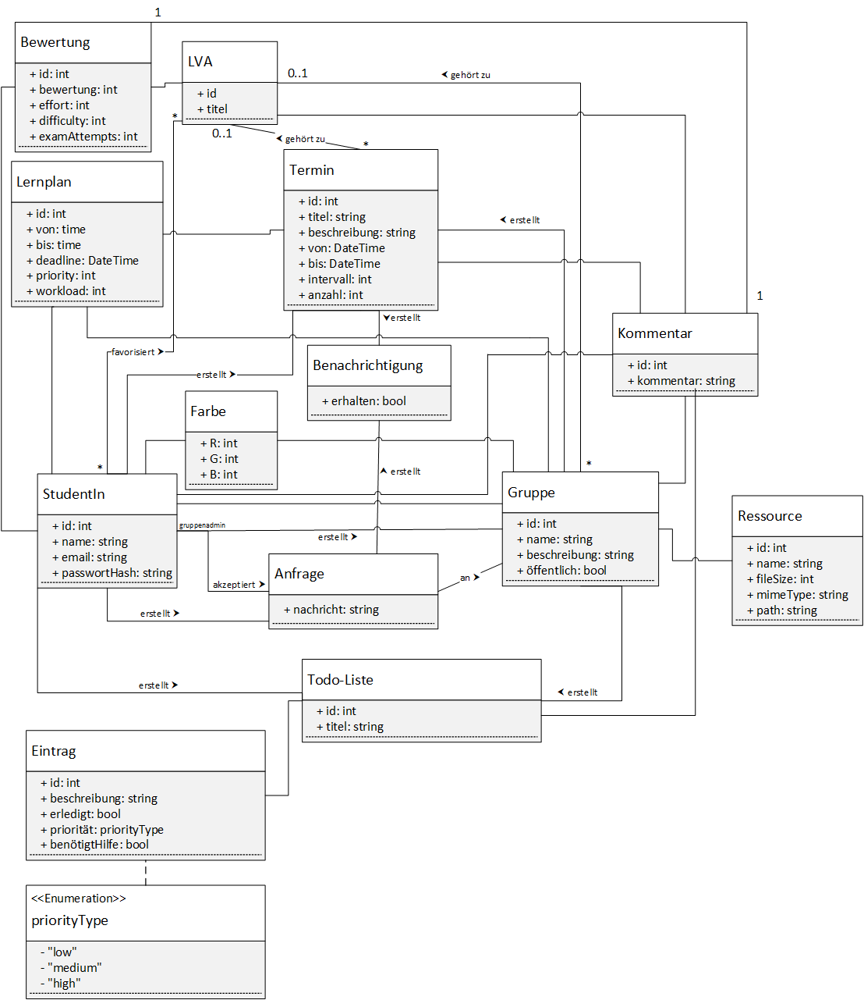

# Projektbezeichnung und Entwicklerteam

Das Projekt trägt den Titel _TUdo_ und wird von folgendem Team umgesetzt:

| Id | Name | Rolle | Stellvertretende Rolle |
| ------ | ------ | ------ | ------ |
| jbernold | Julia Bernold | Dokumentationsbeauftragte | Frontend Lead |
| lnemeskeri | Luke Nemeskeri | Teamkoordinator | Testleiter |
| mflandorfer | Marvin Flandorfer | Backend Lead | Teamkoordinator |
| npeter | Nikolaus Peter | Technischer Architekt | Backend Lead |
| skreuzpointner | Simon Kreuzpointner | Testleiter | Dokumentationsbeauftragter |
| tgruber | Tobias Gruber | Frontend Lead | Technischer Architekt |

# Ausgangssituation
Für Studierende der TU Wien gibt es derzeit mehrere Möglichkeiten zur Organisation ihres Studiums untereinander. Über TISS können Lehrveranstaltungen, im folgenden LVAs, favorisiert werden, wodurch automatisiert in einem Kalender entsprechende LVA Termine angezeigt sowie exportiert werden können. Über Studo tauschen Studierende Erfahrungen und Wissen beliebiger LVAs aus. Und mittels Google Kalender können Termine eingetragen und auch mit anderen geteilt werden. All diese Tools ermöglichen allerdings keine gruppenbasierte Terminkoordination sowie verlässliche Benachrichtigungen für Prüfungstermine oder LVA-Anmeldungen. 

# Projektbeschreibung
Es wird eine Applikation benötigt, welche die Gruppenorganisation zwischen Studierenden ermöglicht und zusätzlich auf bestehende LVAs in TISS zugeschnitten ist.

_TUdo_ ermöglicht Studierenden gemeinsame Gruppenorganisation und Terminplanung mit anderen KommilitonInnen. Es wird ermöglicht, verschiedene Gruppen sowohl für LVAs übergreifend, als auch für spezifische LVAs zu bilden. Diese können privat oder öffentlich sein, wobei im Falle der privaten Sichtbarkeit nur für bereits beigetretenen Personen Zugang besteht, während für öffentliche Gruppen alle Studierende um Beitritt anfragen können.
Zusätzlich ermöglicht _TUdo_ konfigurierbare Benachrichtigungen für diverse LVA-Termine.

_TUdo_ soll nicht die Studienplanung eines Studierenden abdecken, sondern lediglich als unterstützendes Werkzeug fungieren. Es werden keine externen Resourcen (mit Ausnahme von TISS) in Anspruch genommen und _TUdo_ ist nicht als primäres Kommunikationsmittel zwischen Studierenden vorgesehen.

Ein Studierender muss vor der Verwendung ein Konto auf _TUdo_ anlegen, wobei hier keine tatsächliche Immatrikulation überprüft wird. Nach der Registrierung ist es dem Studierenden möglich nach LVAs zu suchen und zu favorisieren, Gruppen zu bilden und beizutreten sowie Termine und To-Do-Listen zu erstellen. In einem Kalender werden den Studierenden alle eigenen sowie Gruppen- und LVA-basierten Termine angezeigt als auch Deadlines für noch offene Punkte auf einer To-Do-Liste.

# Zielgruppen

In erster Linie **TU Wien Studierende**, welche am meisten von _TUdo_ profitieren sollen.

**Studierende anderer Universitäten**, welche immer noch von dem Organisationsaspekt profitieren können, allerdings nicht mehr von TU-Wien-spezifischen Funktionalitäten.

# Featureliste

**Bestehender Funktionsumfang**

| Id | Feature | Beschreibung | Kunden Priorität | Aufwand |
| ------ | ------ | ------ | ------ | ------ |
| 1 | Registrierung und Login | Studierende sollen sich registrieren und anschließend einloggen können. Zur Validierung müssen Email Adressen zusätzlich bestätigt werden. | H | 8 |
| 2A | Kalender | Studierende können eigene, sowie LVA-basierte Termine in einer Kalenderansicht darstellen. | H | 8 |
| 3A | Terminverwaltung | Studierende können eigene Termine erstellen, bearbeiten und löschen. | H | 2 |
| 4A | Suche | Studierende können LVAs suchen und favorisieren. Favorisierte LVAs sind separat einsehbar. | H | 1 |
| 5.1 | LVA Details | LVAs besitzen eine Detailansicht mit grundlegenden Informationen, Terminen, sowie Bewertungen der Studierenden und einem Gruppenfindungs Abschnitt. | M | 3 |
| 5.2 | LVA Bewertung | LVAs können von Studierenden bewertet werden. Diese Bewertungen können in der Details-Ansicht eingesehen werden. | M | 1 |
| 6 | Benachrichtigungen | Studierende können konfigurieren, ob sie für LVA-Anmeldungen oder Prüfungstermine benachrichtigt werden wollen. | M | 2 |
| 7A | Kommentare | Studierende können zu Terminen Kommentare hinzufügen. Zusätzlich können Studierende zu ihren Bewertungen Kommentare hinterlassen. | L | 2 |
| 8 | SSO Login?? | Studierende der TU Wien können sich mittels TU Single Sign-On anmelden. | L | 13 |
| 9 | CAL Import | Studierende können CAL (.cal) Dateien in den Kalender importieren. | L | 8 |

**Neue Features**

| Id | Feature | Beschreibung | Kunden Priorität | Aufwand |
| ------ | ------ | ------ | ------ | ------ |
| 2B | Kalender | Studierende können gruppenbasierte sowie aus Lernplänen hervorgehende Termine in einer Kalenderansicht darstellen. | H | 5 |
| 3B | Terminverwaltung | GruppenadministratorInnen können gruppenbasierte Termine erstellen, bearbeiten und löschen. | H | 2 |
| 4B | Suche | Studierende können öffentliche Gruppen, optional nach LVAs gefiltert, suchen. | H | 1 |
| 7B | Kommentare | Studierende können zu ToDos und Gruppen Kommentare hinzufügen, bearbeiten und löschen. | L | 3 |
| 10.1 | Gruppenverwaltung | Studierende können gemeinsame Gruppen erstellen, bearbeiten und löschen. Es können beliebige Studierende als Mitglieder hinzugefügt, aber auch wieder entfernt werden. | H | 5 |
| 10.2 | Gruppenadministration | Es sollen GruppenadministratorInnen festgelegt werden können. Nur diese können beliebigen Studierenden Beitrittsanfragen senden, diese wieder zurücknehmen bzw. nach Annahme entfernen und auch zu AdministratorInnen ernennen. Des Weiteren können Gruppenbeschreibungen und Mitglieder-Berechtigungen konfiguriert werden. Gruppen-ErstellerInnen sind automatisch AdministratorInnen. | H | 8 |
| 10.3 | Gruppenbeitritt | Studierende können öffentlichen Gruppen eine Beitrittsanfrage stellen und ggf. wieder zurückziehen. Nach Annahme seitens der AdministratorInnen erfolgt der Beitritt. | H | 5 |
| 11 | Lernpläne | Studierende oder Gruppen können Lernpläne erstellen, bearbeiten und löschen. Für die Erstellung sind etwaige Kriterien zum Ausfüllen, wie etwa geschätzter Zeitaufwand, Priorität, Intervalle und Zeitressourcen. Daraufhin werden Termine für Lerneinheiten vorgeschlagen, welche noch manuell umgeordnet und im weiteren Schritt automatisch erstellt werden können. | M | 20 |
| 12 | ToDo Listen | Studierende können ToDo Listen erstellen, bearbeiten oder löschen. ToDo Listen können auch von GruppenadministratorInnen für Gruppen verwaltet werden. Einzelne Unterpunkte können mit Deadlines versehen werden. | M | 8 |
| 13 | Ressourcenverwaltung | Gruppen-AdministratorInnen können Dateien mit der Gruppe teilen und nachträglich wieder entfernen. | M | 13 |

# Domänenmodell

